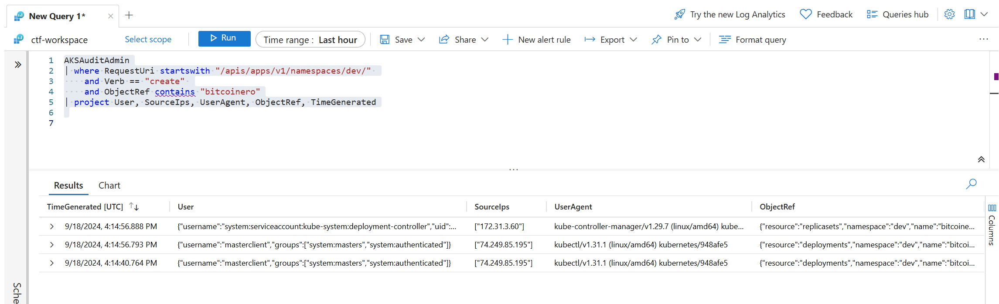

# Free Compute: Scenario 1 Defense

## Backstory

### Name: __Blue__

* Overworked
* Can only do the bare minimum
* Uses defaults when configuring systems
* Usually gets blamed for stability or security issues
* Has no experience operating Kubernetes clusters

### Motivations

* __Blue__ gets paged at 1am with an “urgent” problem: the developers say “the website is slow”
* __Blue__ reluctantly agrees to take a “quick look”
* __Blue__ wants desperately to get back to sleep. Zzz

## Defense

__Blue__ looks at the page with an unsurprising lack of details, and spends a few minutes getting the answer to exactly _which_ website they are referring to that is underperforming.  It's "the one running in Kubernetes", they said.  __Blue__ leverages their Cloud Shell terminal to begin the process of troubleshooting the issue.

### Identifying the Issue

The first step is to determine the name for the web application `deployment` in question.  From the terminal, __Blue__ runs the following to see a listing of all `pods` in all `namespaces`:

```console
kubectl get pods --all-namespaces
```

The `cluster` is relatively small in size, but it has a couple `deployments` that could be the site in question.  The development team mentions performance is an issue, so __Blue__ checks the current CPU and Memory usage with:

```console
kubectl top node
```

and

```console
kubectl top pod --all-namespaces
```

It appears that a suspcious `deployment` named `bitcoinero` is running, and its causing resource contention issues.  __Blue__ runs the following to see the `pod's` full configuration:

```console
kubectl get deployment -n dev bitcoinero -o yaml
```

It was created very recently, but there are no ports listening, so this looks unlikely to be part of the website.  Next, __Blue__ grabs a consolidated listing of all images running in the `cluster`:

```console
kubectl get pods --all-namespaces -o jsonpath="{..image}" | tr -s '[[:space:]]' '\n' | sort -u
```

### Confirming the Foreign Workload

__Blue__ sends a message back to the developers asking for confirmation of the suspicious `bitcoinero` image, and they all agree they don't know who created the `deployment`. __Blue__ looks at the audit logs for the AKS cluster in the Azure Portal.

!!!note "Note"
    You may need to [change from *Simple Mode* to *KQL Mode*](https://learn.microsoft.com/en-us/azure/azure-monitor/logs/log-analytics-simple-mode#switch-modes) in your Log Analytics Workspace

```kql
AKSAuditAdmin
| where RequestUri startswith "/apis/apps/v1/namespaces/dev/" 
    and Verb == "create" 
    and ObjectRef contains "bitcoinero"
| project User, SourceIps, UserAgent, ObjectRef, TimeGenerated
```


__Blue__ sees that the `bitcoinero` `deployment` was created by the cluster admin using the kubectl commandline interface. The IP addresses also show that whoever this was connected from outside the company network.

### Cleaning Up

Unsure of exactly _who_ created the `bitcoinero` `deployment`, __Blue__ decides that it's now 3am, and the commands are blurring together.  The website is still slow, so __Blue__ decides to  delete the `deployment`:

```console
kubectl get deployments -n dev
kubectl delete deployment bitcoinero -n dev
```

### Stopping further intrusions

__Blue__ remembers that when deploying the AKS cluster they had the option to specify what IP addresses are allowed to connect to the public API server of the cluster. Perhaps now is the time to implement that feature. Let's make sure that the API server will only accept connections from __Blue's__ IP as well as any ip within the corporate network:
```console
MY_PUBLIC_IP=$(curl -s api.ipify.org)
az aks update -n $AKS_NAME -g $RESOURCE_GROUP \
    --api-server-authorized-ip-ranges $MY_PUBLIC_IP/32
```
!!!tip Tip
    The above command takes about 3-5 minutes.

### Giving the "All Clear"

Seeing what looks like a "happy" `cluster`, __Blue__ emails their boss that there was a workload using too many resources that wasn't actually needed, so it was deleted.  Also, they added some additional "security" just in case.
