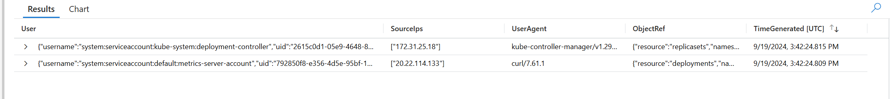

## Backstory

### Name: __Blue__

* Still overworked
* Still can only do the bare minimum
* Uses the defaults when configuring systems
* Usually gets blamed for stability or security issues

### Motivations

* A week after the first incident, __Blue__ gets paged at 3am because “the website is slow again”.
* __Blue__, puzzled, takes another look.
* __Blue__ decides to dust off the résumé “just in case”.

## Defense

__Blue__ is paged again with the same message as last time. What is going on? Could this be the same problem again?

### Identifying the Issue

Let's run some basic checks again to see if we can find random workloads:

```bash
kubectl get pods --all-namespaces
```

It's back! But how? Let's check the audit logs again:

```kql
AKSAuditAdmin
| where RequestUri startswith "/apis/apps/v1/namespaces/dev/deployments" 
    and Verb == "create" 
    and ObjectRef contains "bitcoinero"
| project User, SourceIps, UserAgent, ObjectRef, TimeGenerated
```


How did a service account associated with the metrics-server create a deployment? And what is that sourceIP, it looks familiar...

Let's fetch the public egress IP address for the cluster API server.
First start a pod we can use to curl out of the cluster:

```bash
kubectl run curl --rm -it --image=alpine/curl -- sh
```

From within the pod, fetch the cluster egress ip from an external ip echo service:
```bash
curl icanhazip.com
exit
```

So let me get this straight... the `bitcoinero deployment` was created by another deployment's service account, using curl, from *inside* the cluster? 

__Blue__ is starting to suspect that there may be an unwanted visitor in the cluster. But how to find them? Let's by looking for `ClusterRoles` with high levels of permissions.

List all ClusterRoles with unlimited access to all APIs and resource types:
```bash
kubectl get clusterrole -o json | jq '.items[] | select(.rules[]?.resources == ["*"] and .rules[]?.verbs == ["*"] and .rules[]?.verbs == ["*"]) | .metadata.name'
```

`cluster-admin` is the only role that *should* be in that list. What is this `privileged-role` that we are also seeing?
```bash
kubectl get clusterrolebinding -o json | jq '.items[] | select(.roleRef.name == "privileged-role")'
```

Why would the `metrics-server` need such high level privileges? Let's take a closer look at that deployment.

Look at the command that is being run for the deployment.  (Hint: Should a metrics server be running sshd?)
```bash
kubectl get deployment -n kube-system metrics-server-deployment -o yaml
```

Look at the metric-server service.  (Hint: Should that be public?)
```bash
kubectl get svc -n kube-system metrics-server-service -o yaml
```

`metrics-server` is actually running an SSH server! And it's running as a privileged container! This is *bad*. We need to clean this up fast!

### Fixing the Leak
__Blue__ decides it is time to evict this bad actor once and for all. Let's delete all of their work:
```bash
# Service
kubectl delete service -n kube-system metrics-server-service --wait=false
# Deployment
kubectl delete deployment -n kube-system metrics-server-deployment --wait=false
# ClusterRoleBinding
kubectl delete clusterrolebinding privileged-binding
# ClusterRole
kubectl delete clusterrole privileged-role
# ServiceAccount
kubectl delete sa -n kube-system metrics-server-account
# bitcoinero
kubectl delete deployment bitcoinero -n dev --wait=false
```

The fire is out (for now). But clearly we need more robust security to keep the bad guys out. How can we restrict access to ensure that only trusted users can interact with the cluster control plane?

Let's enable [Entra ID integration](https://learn.microsoft.com/en-us/azure/aks/enable-authentication-microsoft-entra-id) and disable local administrative accounts. This way only users who are authenticated by our Entra tenant will have access to the cluster and we can control what those user can do by managing group membership in Entra.

First we will want to create a group in Entra that contains all of the cluster admins (and make sure our account is in it so we don't get lockd out):
```bash
GROUP_NAME=AKSAdmins$RANDOM
ADMIN_GROUP=$(az ad group create --display-name "$GROUP_NAME" --mail-nickname "$GROUP_NAME" --query id -o tsv)
az ad group member add --group "$GROUP_NAME" --member-id $(az ad signed-in-user show --query id -o tsv)
```

Now let's enable EntraID integration and disable local accounts: 
```bash
az aks update --resource-group $RESOURCE_GROUP --name $AKS_NAME \
  --enable-aad \
  --aad-admin-group-object-ids $ADMIN_GROUP \
  --disable-local-accounts
```
:::tip
The above command takes about 8 minutes to complete.
:::

Finally, we need to rotate the cluster certificates in order to invalidate the existing leaked admin credentials. This will require us to authenticate against EntraID for all future cluster administration:
```bash
az aks rotate-certs --resource-group $RESOURCE_GROUP --name $AKS_NAME -y
```
:::tip
The above command takes about 6 minutes to complete.
:::

We can verify that we have lost access to cluster by running any kubectl command:
```bash
kubectl get pods
```

To reconnect to the cluster we will need to fetch new credentials, this time backed by Entra:
```bash
az aks get-credentials --resource-group $RESOURCE_GROUP --name $AKS_NAME --overwrite-existing
kubectl get pods -A
```

Now, when we try to interact with the cluster, we are prompted to login with our Entra credentials.

:::note
If you are running this lab inside of a managed tenant with strict conditional access policies you may need to run `az login && kubelogin convert-kubeconfig -l azurecli` before connecting to the cluster.
:::

Confident that the cluster is now running in "Fort Knox" mode, __Blue__ decides to call it a night and head back to bed.

:::note
Another layer of security that would be a good idea to investigate here is [Azure Policy](https://learn.microsoft.com/en-us/azure/aks/use-azure-policy). But for the purposes of this lab, we will skip it for now.
:::